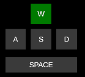

# Keyboard Overlay
A customizable keyboard overlay system made in Unity for visualizing key presses — works both in-game and as build.

---

## 🚀 Features
- Displays pressed keys with smooth color transitions  
- Fully customizable through the Unity Editor (layout, font, color, position, etc.)  
- Works on top of any Unity scene (including games)  
- Simple setup — just assign a key and it reacts visually  
- Uses `GetAsyncKeyState` (via `user32.dll`) for input detection even when unfocused  

---

## 🎮 Controls

Click to view

| Action | Key / Input |
|--------|--------------|
| Key Visualization | Depends on assigned key |

---

## 🧩 How to Use
1. Clone or download the project.  
2. Open it in **Unity 6000.0.58f2+** (or newer).  
3. In the scene, each key element has a **KeyboardOverlayKey** script attached.  
4. Assign a **KeyCode** in the Inspector to each image/text element.  
5. Customize visuals directly in Unity (fonts, positions, colors, animations, etc.).  
6. Build and run — the overlay will work both in focus and during gameplay.  

---

## ⚙️ Notes
- Layout customization requires editing inside Unity, then rebuilding.  
- Because it’s made for developers, it prioritizes **flexibility** over convenience.  
- Ideal for internal use, stream overlays, or custom visual training tools.  

---

## 📷 Screenshots

---

## 🧑‍💻 Author
**Hunter**

## ⚖️ License & Copyright
© 2025 Hunter. All rights reserved.  
This project is provided for personal and educational use.  
Redistribution, modification, or commercial use without explicit permission is prohibited.  
